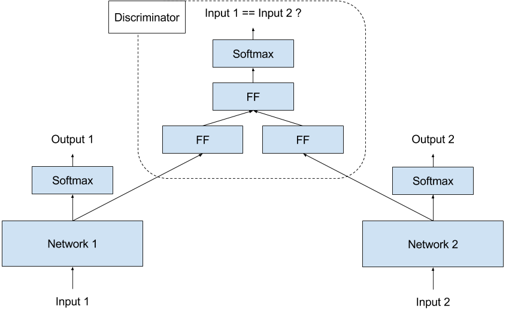
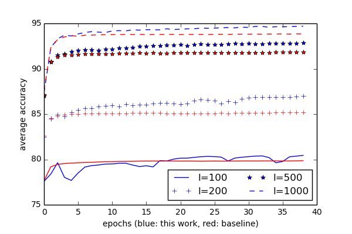
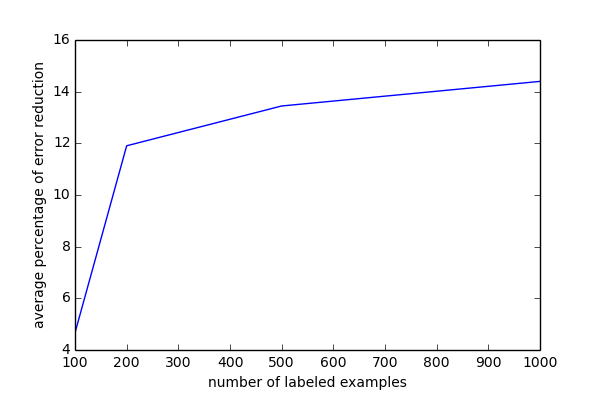

# Enforcing Networks Diversity Using Adversarial Training

## Introduction

Representation learning is an important concept in deep learning where the network automatically learns how to encode its input. To train an ensemble of networks, it is advantages if each network learns a different representation for the input. This diversity of representations makes the ensemble more robust and more accurate. Usually, we rely on random initializations to steer each network toward a different representation, but there is no guarantee that they won’t end up learning the same thing.

The goal of this project is to train the networks of the ensemble while enforcing that they learn different representations. We use an adversarial training with a discriminator that penalizes the networks if they learn the same thing. The resulting networks perform better in an ensemble.

## Model and Training

The figure above shows the architecture of our model. It has two identical networks that will be ensembled, and a discriminator that penalizes them if they learn the same input representation.

Our hypothesis is that if network1 and network2 learn the same representation, and we feed the same input to both networks, then it should be easy to learn a function that maps both representations to each other. As a proxy task, we train the discriminator to find out if input1 and input2 are identical or not. If the discriminator can’t differentiate between identical inputs and non-identical inputs, this means the representations learned by the two networks are quite distinct. 

We randomly sample pairs of (input1, input2) such that input1 == input2 50% of the time, and input1 != input2 for the other 50%. We follow the general scheme of training GANs, we freeze the weighs of the two networks and train the discriminator to minimize its loss, then freeze the weights of the discriminator and train the two networks with the objective of maximizing the loss of the discriminator.

## Preliminary Results

We implemented this idea on the image classification dataset MNIST. We compare between ensembling two regular networks (baseline) and two networks that are trained with the procedure explained above. The networks are straight forward convnets. We try it for a different number of labeled examples and report results for an average of 5 random runs. We don’t use the full training set because the accuracy is already close to 100%. The ensemble is simply the average of the network posteriors. 

The figure above shows that ensembling networks that are trained with our discriminator consistently outperforms the baseline.

The figure above shows more than 12% error reduction in most cases after using our training procedure.

## What’s next

* Apply the same idea to semi-supervised learning
* Explore other tasks and datasets
* Extending the ensemble to more than two networks

## People

Islam Beltagy and Waleed Ammar

## Acknowledgement

We thank Abdel-rahman Mohamed for the insightful discussions. 

All experiments were run on the machines of the Computer Science Department, The University of Texas at Austin
